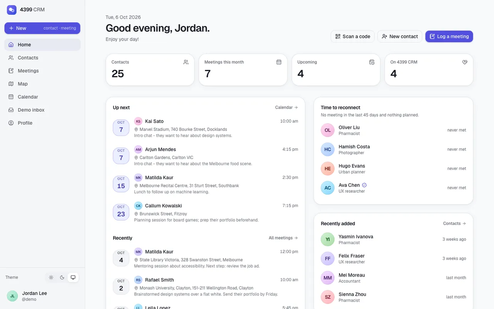
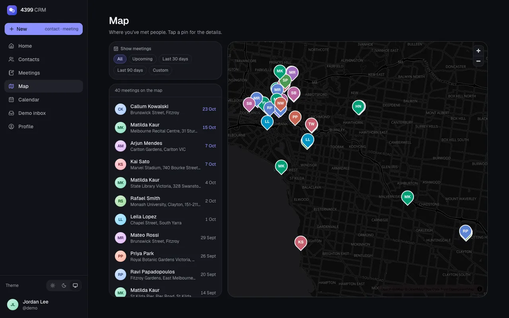
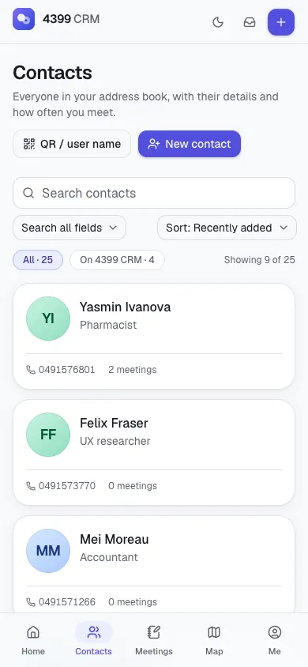
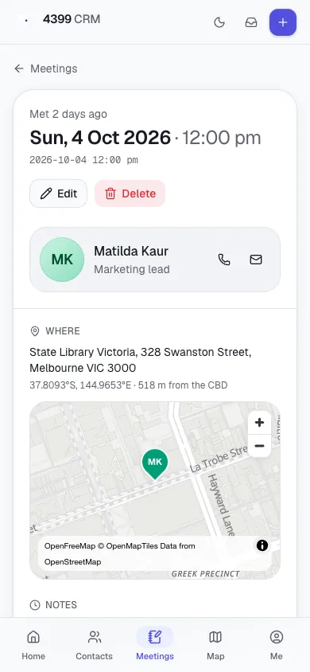
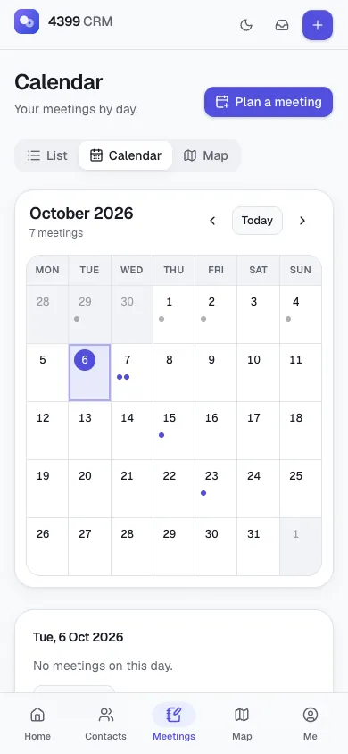
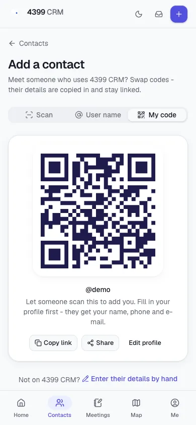

<div align="center">

# 4399 CRM - Personal Customer Relationship Management

**A mobile-first personal CRM: contacts, geo-tagged meetings, a map, a calendar and QR-code contact exchange.**
Built by Team 4399 for COMP30022 IT Project (The University of Melbourne, 2021 Semester 2), revived in 2026 as a single Next.js app.

**Live demo:** _coming soon (Vercel: `comp30022-personal-crm`)_


</div>

---

## What it is

The coursework asked teams of five to build, with a client, a **personal customer relationship manager**: a web
app where one person can keep track of the people in their network and their interactions with them, with
secure accounts, search, testing and a real deployment. Team 4399 built a phone-first single-page app (designed
at 375 x 812) on an Express + MongoDB REST API.

That deployment (Heroku, MongoDB Atlas, Gmail SMTP, Google Maps) no longer exists. This repository keeps the
original submission in [`coursework/`](coursework) and adds [`web/`](web), a faithful port to a free, modern,
self-contained stack:

| Feature | 2021 | 2026 revival |
| --- | --- | --- |
| Accounts | Register with e-mail code, login, reset password, change password, "fast register" invite links | Same flows; e-mails land in an on-screen **demo inbox** (`email_outbox` table) instead of Gmail |
| Contacts | Multiple phones / e-mails, notes, custom fields, photo; search any field, sort, "More" paging | Same rules (ported search/sort/validation), generated initials avatars + optional small photo |
| Add contacts | By hand, by user name, by scanning the other person's QR code | Same; camera scanning via `BarcodeDetector` / ZXing-wasm, or upload a photo of the code |
| Linked contacts | Duplicate detection, link to registered accounts, sync details from the account | Same identity rules (ordered phone/e-mail list equality), one-tap sync |
| Meeting records | Who, when, where (Google Places), notes, custom fields | MapLibre + OpenFreeMap location picker with Photon search, reverse geocoding |
| Views | Records list, Google map with date range | List, **map** with date presets, **calendar**, home dashboard ("Up next", "Time to reconnect") |
| Data | MongoDB Atlas | SQLite via libSQL + Drizzle (Turso in production), deterministic seed |
| Admin | - | `/admin/records`: every table with counts, search, pagination and CSV export |

Try it without signing up: **"Try as guest"** creates a private 24-hour sandbox with 25 contacts and 40 meetings
around Melbourne. The shared demo credentials (`demo` / `admin`) are shown on the login page.

## Screenshots

| Home (desktop) | Map (dark) |
| --- | --- |
|  |  |

| Contacts | Meeting | Calendar | Add by QR |
| --- | --- | --- | --- |
|  |  |  |  |

## Tech stack

- **Framework:** Next.js 16 (App Router, Server Components, Server Actions, Route Handlers, `proxy.ts`), React 19, TypeScript (strict)
- **UI:** Tailwind CSS 4, shadcn/ui (Radix), lucide-react, next-themes (light / dark / system), Geist + Instrument Serif via `next/font`, sonner
- **Data:** SQLite through `@libsql/client` + Drizzle ORM; Turso in production, `/tmp` copy of the seed snapshot as a fallback on Vercel
- **Auth:** bcrypt (`bcryptjs`, cost 10 as in the original) + signed httpOnly session cookies (`jose`), zod-validated actions
- **Maps & places:** MapLibre GL via `react-map-gl/maplibre`, OpenFreeMap vector tiles, Photon geocoding (Nominatim / bundled gazetteer fallbacks), haversine distances, offline GeoJSON basemap
- **QR:** `qrcode` (generation), native `BarcodeDetector` or the `barcode-detector` ZXing-wasm ponyfill (scanning)
- **Testing:** Vitest - parity tests that run the original 2021 functions next to the ports, plus integration tests of the server layer against a temporary SQLite database
- **Tooling:** pnpm, ESLint (flat config), Prettier, GitHub Actions CI, `uv` for the Python data script

## Repository structure

```
.
├── README.md
├── LICENSE
├── .github/workflows/ci.yml      lint, typecheck, test and build web/ on every push and PR
├── coursework/                   the original 2021 submission (moved with git mv, history preserved)
│   ├── frontend/                 React 16 client (CRA)
│   ├── backend/                  Express 4 + Mongoose 5 API (copied from the team repository, secrets redacted)
│   ├── _archive/                 the original README of this repository
│   └── README.md
├── docs/screenshots/             images used in this README
├── scripts/
│   └── build_geodata.py          builds the offline basemap + Melbourne gazetteer (uv, PEP 723)
└── web/                          the deployable Next.js app (Vercel root)
    ├── data/seed.db              committed seed snapshot (open it with any SQLite browser)
    ├── drizzle/                  generated SQL migrations
    ├── public/data/              basemap.geojson (generated)
    ├── scripts/copy-assets.mjs   copies the MapLibre worker + ZXing wasm into public/vendor
    └── src/
        ├── app/                  routes: landing, (auth) login/signup/reset/invite, (app) home, contacts,
        │                         records, map, calendar, profile, inbox, admin/records; api/ route handlers
        ├── components/           ui/ (shadcn), layout/, contacts/, records/, maps/, auth/, inbox/, ...
        ├── db/                   schema.ts, client.ts, migrate/seed/reset scripts, demo accounts
        ├── server/               server-only services (ported controllers) and actions/
        ├── lib/                  framework-free domain logic; lib/legacy/ holds the 1:1 ports
        └── hooks/
```

## Local development

Requirements: Node.js 20+ (CI uses 22) and pnpm 10.

```bash
cd web
pnpm install          # also copies the MapLibre worker and ZXing wasm into public/vendor
pnpm dev              # http://localhost:3000 - uses data/app.db, created from data/seed.db on first run
```

No environment variables are needed locally. See [`web/.env.example`](web/.env.example) for the production ones
(`DATABASE_URL`, `DATABASE_AUTH_TOKEN`, `SESSION_SECRET`).

| Script | What it does |
| --- | --- |
| `pnpm lint` / `pnpm typecheck` / `pnpm test` / `pnpm build` | Quality gates (all run in CI) |
| `pnpm db:reset` | Rebuild `data/app.db` from migrations + seed |
| `pnpm db:snapshot` | Rebuild the committed `data/seed.db` snapshot |
| `pnpm db:generate` | Generate a migration after editing `src/db/schema.ts` |
| `pnpm db:migrate` / `pnpm db:seed` | Apply migrations / seed `DATABASE_URL` (e.g. a fresh Turso database) |
| `pnpm db:studio` | Browse the database with Drizzle Studio |

### Deployment notes

- Vercel project root: `web/`. Set `SESSION_SECRET`, and for persistent shared data `DATABASE_URL` +
  `DATABASE_AUTH_TOKEN` of a Turso database (run `pnpm db:migrate && pnpm db:seed` against it once).
- Without a database URL the app copies `data/seed.db` to `/tmp/app.db` on cold start (writable but ephemeral)
  and shows a "demo storage resets periodically" notice.

## How the data artefacts are generated

| Artefact | Source | Command |
| --- | --- | --- |
| `web/public/data/basemap.geojson` | Natural Earth admin-1 boundaries (public domain), simplified; Victoria clipped to Greater Melbourne | `uv run scripts/build_geodata.py --basemap` |
| `web/src/lib/data/melbourne-places.json` | ~100 Melbourne suburbs and landmarks looked up once via Photon (data © OpenStreetMap contributors, ODbL) | `uv run scripts/build_geodata.py --places` |
| `web/data/seed.db` | Drizzle migrations + `src/db/seed` (deterministic synthetic data: fictional names, `example.*` e-mails, ACMA fiction-range phone numbers) | `cd web && pnpm db:snapshot` |

Downloads are cached in `scripts/.cache/` (git-ignored). No course-provided data, assignment specs or personal
photos are used or hosted.

## Faithfulness to the original

The ported logic lives in [`web/src/lib/legacy`](web/src/lib/legacy) and the server layer in
[`web/src/server`](web/src/server). `src/lib/legacy/parity.test.ts` loads the original functions straight out of
`coursework/` (`convert`, `listCompare`, `autoCodeGenerator`, `passwordValidation`, `dataValidator`, the contact and
record search filters and `sortContact`) and checks the ports return identical results. Other tests replay
fixtures from the team's Jest suites (e.g. the `synchronizationContactInfo` and record integration tests).

Deliberate, documented deviations:

- **Security fixes:** queries are scoped to the signed-in owner (the original trusted any `_id` from the client);
  the reset endpoint no longer accepts a constant `codeVerified: "4399CRMVerified"`; e-mail codes allow 5 attempts;
  sessions are httpOnly cookies instead of a JWT in `localStorage`.
- **Bug fixes:** "sort by time / add date" compares timestamps rather than 12-hour strings; a missing meeting time
  defaults to the real current instant (the original stored wall-clock time labelled as UTC); the "new password
  must differ" rule actually works; the fast-register verifier's inverted check is corrected.
- **Demo adaptations:** e-mails go to the demo inbox; reset codes are only shown to browsers that signed in to the
  account before; avatars are generated initials (optional photos are stored as small data URLs).

## Credits

**Team 4399 (Group 49), COMP30022 IT Project, 2021 Semester 2**

| Name | Role |
| --- | --- |
| Bin Liang | Back-end lead |
| Hongji (Harrison) Huang | Communication lead, original repository owner |
| Wei Zhao | Front-end lead |
| Yixiao Tian | Communication lead |
| Sunchuangyu (Rin) Huang | Scrum Master, front-end (contacts, records, map) |

The original back-end lives at [Harrison-Huang666/COMP30022-49](https://github.com/Harrison-Huang666/COMP30022-49)
(branch `Back-End`). Map data © OpenStreetMap contributors; tiles by OpenFreeMap; geocoding by Photon (komoot).

## Academic integrity

This is a portfolio revival of a completed 2021 university project, not a resubmission. The original submission
is preserved for reference in [`coursework/`](coursework) - unchanged apart from removed credentials (see
[`coursework/README.md`](coursework/README.md)). The assignment specification is paraphrased, not reproduced.

## License

[MIT](LICENSE) © 2021 UNIMELB COMP30022 Team 049
