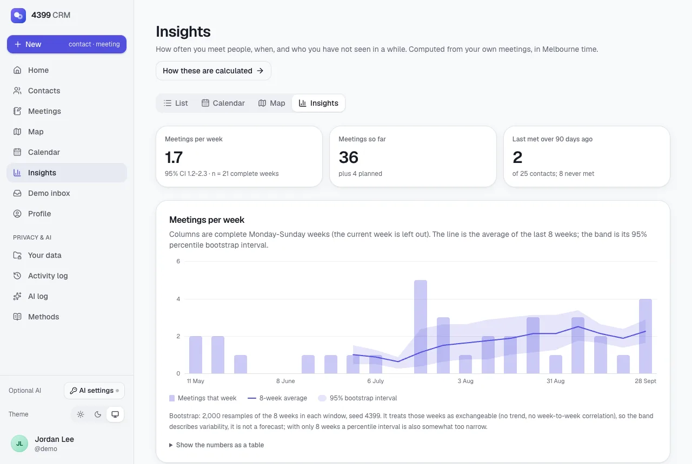
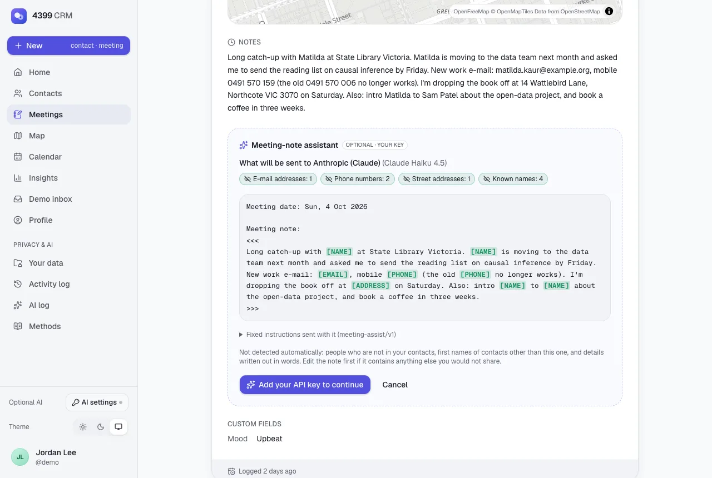
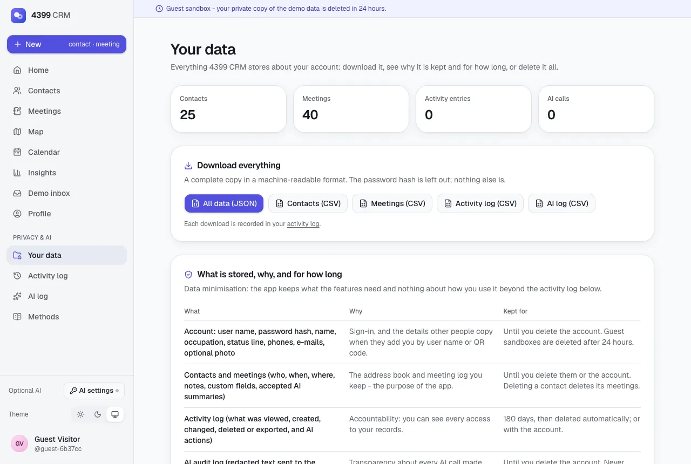
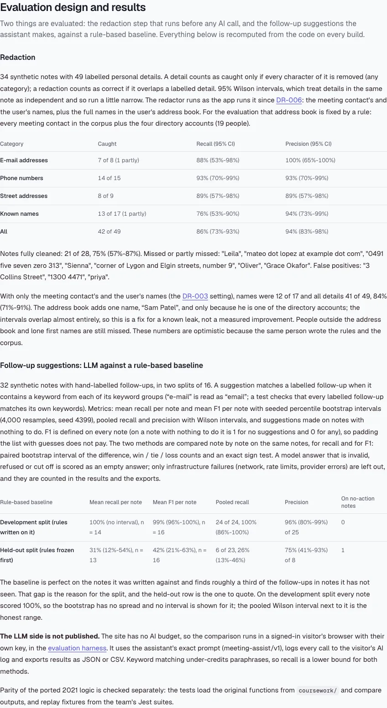
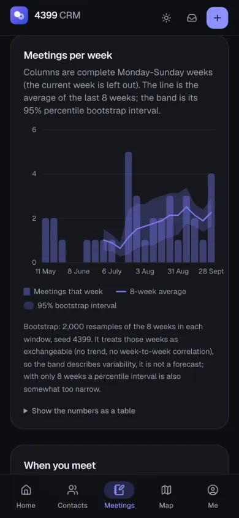

<div align="center">

# 4399 CRM - Personal Customer Relationship Management

**A mobile-first personal CRM: contacts, geo-tagged meetings, a map, a calendar and QR-code contact exchange.**
Built by Team 4399 for COMP30022 IT Project (The University of Melbourne, 2021 Semester 2), revived in 2026 as a single Next.js app,
then extended with insights that show their uncertainty, data rights, an activity log and an optional bring-your-own-key AI assistant.

**Live demo: [comp30022-personal-crm.vercel.app](https://comp30022-personal-crm.vercel.app)**


</div>

---

## What it is

The coursework asked teams of five to build, with a client, a **personal customer relationship manager**: a web
app where one person can keep track of the people in their network and their interactions with them, with
secure accounts, search, testing and a real deployment. Team 4399 built a phone-first single-page app (designed
at 375 x 812) on an Express + MongoDB REST API.

That deployment (Heroku, MongoDB Atlas, Gmail SMTP, Google Maps) no longer exists. This repository keeps the
original submission in [`coursework/`](coursework) and adds [`web/`](web), a faithful port to a free, modern,
self-contained stack:

| Feature | 2021 | 2026 revival |
| --- | --- | --- |
| Accounts | Register with e-mail code, login, reset password, change password, "fast register" invite links | Same flows; e-mails land in an on-screen **demo inbox** (`email_outbox` table) instead of Gmail |
| Contacts | Multiple phones / e-mails, notes, custom fields, photo; search any field, sort, "More" paging | Same rules (ported search/sort/validation), generated initials avatars + optional small photo |
| Add contacts | By hand, by user name, by scanning the other person's QR code | Same; camera scanning via `BarcodeDetector` / ZXing-wasm, or upload a photo of the code |
| Linked contacts | Duplicate detection, link to registered accounts, sync details from the account | Same identity rules (ordered phone/e-mail list equality), one-tap sync |
| Meeting records | Who, when, where (Google Places), notes, custom fields | MapLibre + OpenFreeMap location picker with Photon search, reverse geocoding |
| Views | Records list, Google map with date range | List, **map** with date presets, **calendar**, home dashboard ("Up next", "Time to reconnect") |
| Data | MongoDB Atlas | SQLite via libSQL + Drizzle (Turso in production), deterministic seed |
| Admin | - | `/admin/records`: every table with counts, search, pagination and CSV export; secrets always masked, visitors' personal data masked, every read logged |
| Insights | - | `/insights`: meetings per week with a seeded bootstrap interval, weekday x hour heatmap, contacts by recency |
| Your data | - | `/your-data`: export everything (JSON + CSV), hard-delete the account; `/activity`: append-only access log |
| AI | - | Optional meeting-note assistant with your own Anthropic or OpenAI key, redaction before sending, Accept / Edit / Reject, `/ai-log` audit trail |
| Methods | - | [`/methods`](https://comp30022-personal-crm.vercel.app/methods): parity map of all 40 endpoints, evaluation results, AI use statement, decision records, model card |

Try it without signing up: **"Try as guest"** creates a private 24-hour sandbox with 25 contacts and 40 meetings
around Melbourne. The shared demo credentials (`demo` / `admin`) are shown on the login page.

## 2026 upgrade: statistics, privacy and human-in-the-loop AI

The revival kept the 2021 behaviour (see [Faithfulness to the original](#faithfulness-to-the-original)) and then added
features that are meant to be checked, not taken on trust. Everything below is on the [methods page](https://comp30022-personal-crm.vercel.app/methods),
including the weak results.

- **Functional parity map.** All 40 REST endpoints of the 2021 Express API are mapped to their Server Action or
  Server Component replacement: 15 implemented as before, 24 changed (with the reason) and 1 dropped. A unit test
  (`web/src/lib/methods/parity.test.ts`) reads the original router files, checks the table covers every endpoint and checks
  that every named replacement is really exported.
- **Insights** (`/insights`). Meetings per complete week with the trailing 8-week mean and its 95% percentile bootstrap
  interval (2,000 resamples, seed 4399, both shown on the page), a weekday x hour heatmap, and contacts grouped by time since
  the last meeting (a census, so deliberately no confidence intervals). Assumptions and a table view sit under each chart.
- **Statistics helpers** (`web/src/lib/stats`): normal quantile (AS 241), Wilson score interval, exact sign test,
  type-7 quantiles, percentile and paired bootstrap. Unit-tested against scipy and R values from
  [`scripts/stats_reference.py`](scripts/stats_reference.py).
- **Your data** (`/your-data`). Download everything stored about the account (one JSON file, or CSV per table), see what
  is stored, why and for how long, and hard-delete the account. Deletion removes the account and every contact, meeting,
  link, invitation, demo-inbox e-mail, pending code, activity entry and AI-log entry in one database transaction; one
  anonymous row (counts only) records that it happened. Signing out or deleting the account also forgets any AI key in the browser.
- **Activity log** (`/activity`, and `activity_log` in `/admin/records`). Append-only: views of contact and meeting pages
  (repeat views within a minute are logged once), creates, changes, deletes and exports, sign-ins, sign-outs, sign-ups and
  password resets, profile changes, AI actions, and every admin table view or export (under the admin account). It stores
  ids, field names and counts, never the contents. Entries older than 180 days are never shown or exported and are deleted
  at server start.
- **The public demo admin is treated as untrusted** ([DR-005](docs/decisions/DR-005-mask-the-public-demo-admin.md)).
  Anyone can press "Demo admin", so `/admin/records` always masks password hashes, e-mail codes, invitation links and the
  inbox browser key, and shows names, contact details, notes and AI text only for the seeded demo accounts. A review
  before merge found that the first version let anyone read live password-reset codes; the decision record says so.
- **Meeting-note assistant (optional, bring your own key).** On a meeting page: summarise the note and suggest follow-ups.
  Before anything is sent, e-mail addresses, phone numbers, street addresses, the contact's and user's names and the full
  names of everyone in the address book ([DR-006](docs/decisions/DR-006-redact-address-book-names.md)) are removed in the
  browser, and the visitor sees the exact text and the fixed instructions. The answer is labelled "AI-generated" and is
  only a draft until the person accepts, edits or rejects it; "accepted" always stores the logged answer unchanged.
- **Evaluation harness** (`/ai-log/evaluate`). The same 32 labelled notes go through a rule-based baseline and the LLM
  (the assistant's exact prompt), scored by one matcher and compared note by note on the same notes: mean recall and mean F1
  per note with seeded bootstrap intervals, Wilson intervals for pooled recall and precision, and for recall and F1 a paired
  bootstrap interval of the difference, win / tie / loss counts and an exact sign test. Invalid, refused or cut-off model
  answers count as empty answers; only infrastructure failures are excluded, and they are counted. Results export as JSON or CSV.
- **Decision records and a model card** in [`docs/decisions`](docs/decisions) and [`docs/model-card.md`](docs/model-card.md),
  rendered at `/methods/decisions/...` and `/methods/model-card`.

### Results, including the weak ones

| What | Result (95% interval) |
| --- | --- |
| Redaction recall, 49 labelled details in 34 synthetic notes (with the address book, DR-006) | 42 of 49, 86% (73-93%); names only 13 of 17, 76% (53-90%) |
| Redaction recall with the meeting contact's and user's names only (DR-003) | 41 of 49, 84% (71-91%); names 12 of 17, 71% (47-87%) |
| Redaction precision | 45 of 48, 94% (83-98%) |
| Notes fully cleaned | 21 of 28, 75% (57-87%) |
| Rule-based follow-up baseline, development split (rules written on it) | mean recall 100%, n = 14 notes (every note scored 100%, so no bootstrap interval; pooled 24 of 24, 86-100%) |
| Rule-based follow-up baseline, held-out split (rules frozen first) | mean recall 31% (12-54%), n = 13 notes; mean F1 42% (21-63%), n = 16; precision 6 of 8, 75% (41-93%) |

People who are not in the address book are not redacted at all, and the corpora were written by the same person who wrote
the rules, so the redaction numbers are optimistic. The address book's gain is one name ("Sam Patel", a directory account),
so it is a fixed leak rather than a measured improvement. The baseline's drop from the development to the held-out split is
the reason the split exists. **No LLM results are published:** the site has no AI budget, so the comparison runs in a visitor's browser with
their own key, and every call lands in their AI log.

### Bring your own key

- Open **AI settings** (sidebar, profile page, or the assistant itself). Choose Anthropic (default; Claude Haiku 4.5, or
  Claude Sonnet 5.5) or OpenAI (any model id; default `gpt-5-mini`) and paste your own API key.
- The key is kept in `sessionStorage` (gone when the tab closes) unless you tick "remember on this device"
  (`localStorage`). "Forget keys" removes it; signing out does too.
- Calls go **directly from your browser** to `api.anthropic.com` (with the `anthropic-dangerous-direct-browser-access`
  header) or `api.openai.com`. The key is never sent to this site's server, never logged and never committed. The server
  rejects any audit entry that contains something shaped like an API key.
- Everything else in the app works without a key.

### Viewing the AI audit log

- **As a user:** `/ai-log` lists every call made with your key: the redacted text sent, the answer, requested and
  served model, latency, token usage and your decision (accepted, edited, rejected, or not applicable for evaluation runs).
  Export it as JSON or CSV from that page, or with everything else from `/your-data`.
- **As the admin:** sign in with **Demo admin** and open `/admin/records?table=ai_audit_log` (and `activity_log`). The
  text sent and received is masked for every account except the seeded demo accounts.
- **Locally:** `sqlite3 web/data/app.db "select created_at, feature, model, decision from ai_audit_log"`.

### How the showcase was recorded

Production still has no persistent database (see [DR-004](docs/decisions/DR-004-turso-vs-tmp-fallback.md)): until Turso
is attached, writes live in one serverless instance's `/tmp` copy and can disappear between requests. The journeys for these
features (sign-up through the demo inbox, contact and meeting create / edit / search / delete, add by user name, password
reset, the assistant's redaction preview and Accept / Edit / Reject, the evaluation harness, export and account deletion
with the admin tombstone) were therefore recorded against a **local production build** (`pnpm build && pnpm start -p 3211`)
with Playwright. In that run the AI provider was mocked inside the browser test, so no real key or AI output was used; the
screenshots below show only real, non-AI content.

## Screenshots

| Home (desktop) | Map (dark) |
| --- | --- |
|  |  |

| Contacts | Meeting | Calendar | Add by QR |
| --- | --- | --- | --- |
|  |  |  |  |

2026 upgrade (local production build):

| Insights | What the AI would receive |
| --- | --- |
|  |  |

| Your data | Methods: evaluation | Insights (mobile, dark) |
| --- | --- | --- |
|  |  |  |

## Tech stack

- **Framework:** Next.js 16 (App Router, Server Components, Server Actions, Route Handlers, `proxy.ts`), React 19, TypeScript (strict)
- **UI:** Tailwind CSS 4, shadcn/ui (Radix), lucide-react, next-themes (light / dark / system), Geist + Instrument Serif via `next/font`, sonner
- **Data:** SQLite through `@libsql/client` + Drizzle ORM; Turso in production, `/tmp` copy of the seed snapshot as a fallback on Vercel
- **Auth:** bcrypt (`bcryptjs`, cost 10 as in the original) + signed httpOnly session cookies (`jose`), zod-validated actions
- **Maps & places:** MapLibre GL via `react-map-gl/maplibre`, OpenFreeMap vector tiles, Photon geocoding (Nominatim / bundled gazetteer fallbacks), haversine distances, offline GeoJSON basemap
- **QR:** `qrcode` (generation), native `BarcodeDetector` or the `barcode-detector` ZXing-wasm ponyfill (scanning)
- **Statistics:** small, dependency-free helpers in `web/src/lib/stats` (Wilson, bootstrap, sign test, quantiles), verified against scipy and R
- **AI (optional):** browser-direct `fetch` to the Anthropic Messages API or OpenAI Chat Completions with the visitor's key, JSON-schema structured outputs validated with zod; no AI SDK or server proxy
- **Docs:** decision records and the model card rendered from Markdown with `marked`
- **Testing:** Vitest - parity tests that run the original 2021 functions next to the ports, integration tests of the server layer against a temporary SQLite database, stats tests against scipy / R values, AI-client tests with mocked `fetch`, and the redaction and follow-up evaluations
- **Tooling:** pnpm, ESLint (flat config), Prettier, GitHub Actions CI, `uv` for the Python data script

## Repository structure

```
.
├── README.md
├── LICENSE
├── .github/workflows/ci.yml      lint, typecheck, test and build web/ on every push and PR
├── coursework/                   the original 2021 submission (moved with git mv, history preserved)
│   ├── frontend/                 React 16 client (CRA)
│   ├── backend/                  Express 4 + Mongoose 5 API (copied from the team repository, secrets redacted)
│   ├── _archive/                 the original README of this repository
│   └── README.md
├── docs/
│   ├── decisions/                DR-001 ... DR-006 (rendered at /methods/decisions/...)
│   ├── model-card.md             meeting-note assistant + redactor (rendered at /methods/model-card)
│   └── screenshots/              images used in this README
├── scripts/
│   ├── build_geodata.py          builds the offline basemap + Melbourne gazetteer (uv, PEP 723)
│   └── stats_reference.py        scipy reference values for the statistics unit tests (uv, PEP 723)
└── web/                          the deployable Next.js app (Vercel root)
    ├── content/docs/             copies of docs/decisions + docs/model-card.md (Vercel deploys web/ only; a test checks they match)
    ├── data/seed.db              committed seed snapshot (open it with any SQLite browser)
    ├── drizzle/                  generated SQL migrations
    ├── public/data/              basemap.geojson (generated)
    ├── scripts/copy-assets.mjs   copies the MapLibre worker + ZXing wasm into public/vendor
    └── src/
        ├── app/                  routes: landing, methods (public docs), (auth) login/signup/reset/invite,
        │                         (app) home, contacts, records, map, calendar, insights, profile, inbox,
        │                         your-data, activity, ai-log (+ evaluate), admin/records; api/ route handlers
        ├── components/           ui/ (shadcn), layout/, contacts/, records/, maps/, auth/, inbox/, ...
        ├── db/                   schema.ts, client.ts, migrate/seed/reset scripts, demo accounts
        ├── server/               server-only services (ported controllers) and actions/
        ├── lib/                  framework-free domain logic; lib/legacy/ holds the 1:1 ports; lib/stats,
        │                         lib/ai (BYOK clients), lib/redact, lib/eval, lib/methods (parity map)
        └── hooks/
```

## Local development

Requirements: Node.js 20+ (CI uses 22) and pnpm 10.

```bash
cd web
pnpm install          # also copies the MapLibre worker and ZXing wasm into public/vendor
pnpm dev              # http://localhost:3000 - uses data/app.db, created from data/seed.db on first run
```

No environment variables are needed locally, for `pnpm dev` or for a local `pnpm build && pnpm start` (without
`SESSION_SECRET` a fixed development signing key is used and `pnpm start` logs a warning). On Vercel
`SESSION_SECRET` is **required**. See [`web/.env.example`](web/.env.example) for every variable
(`DATABASE_URL`, `DATABASE_AUTH_TOKEN`, `SESSION_SECRET`).

| Script | What it does |
| --- | --- |
| `pnpm lint` / `pnpm typecheck` / `pnpm test` / `pnpm build` | Quality gates (all run in CI) |
| `pnpm db:reset` | Rebuild `data/app.db` from migrations + seed |
| `pnpm db:snapshot` | Rebuild the committed `data/seed.db` snapshot |
| `pnpm db:generate` | Generate a migration after editing `src/db/schema.ts` |
| `pnpm db:migrate` / `pnpm db:seed` | Apply migrations / seed `DATABASE_URL` (e.g. a fresh Turso database) |
| `pnpm db:studio` | Browse the database with Drizzle Studio |
| `pnpm docs:sync` | Copy `docs/decisions` and `docs/model-card.md` into `web/content/docs` (also runs before `pnpm build`) |

### Deployment notes

- Production: <https://comp30022-personal-crm.vercel.app> (Vercel project `comp30022-personal-crm`, deployed from
  `web/` with `vercel deploy --prod`).
- Vercel project root: `web/`. Set `SESSION_SECRET` (required, 32+ characters), and for persistent shared data `DATABASE_URL` +
  `DATABASE_AUTH_TOKEN` of a Turso database (run `pnpm db:migrate && pnpm db:seed` against it once).
- Pending Drizzle migrations are also applied when each server instance starts (`src/instrumentation.ts`), so the `/tmp`
  copy, an older local `data/app.db` or a newly attached Turso database pick up new tables such as `activity_log` and
  `ai_audit_log`.
- No AI key is configured on the server, by design: AI calls use the visitor's own key in their browser.
- Without a database URL the app copies `data/seed.db` to `/tmp/app.db` on cold start (writable but ephemeral)
  and shows a "demo storage resets periodically" notice. Each serverless instance has its own copy, so a change
  made in one request is not guaranteed to show up in the next one. The live demo currently runs in this mode
  until a Turso database is attached.
- The shared `demo` account's dates follow the calendar: on the first request of a new (UTC) day its meetings,
  contacts and inbox slide forward so "Up next" and the calendar never go stale.

### Viewing the records

- **On the site:** sign in with the one-click **Demo admin** button (credentials are on the login page) and open
  [`/admin/records`](https://comp30022-personal-crm.vercel.app/admin/records): every table with row counts, search,
  pagination and a CSV export per table. Password hashes, codes, invitation links and the inbox browser key are always
  masked; names, contact details, notes and AI text are shown only for the seeded demo accounts (DR-005). Every view and
  export is logged under the admin account. `activity_log` and `ai_audit_log` hold the access log and the AI audit trail.
- **Turso (when attached):** `turso db shell comp30022-personal-crm "select count(*) from contacts"`.
- **Locally:** open `web/data/seed.db` (committed snapshot) or `web/data/app.db` (your local copy) in any SQLite
  browser, or run `pnpm db:studio` in `web/`.

## How the data artefacts are generated

| Artefact | Source | Command |
| --- | --- | --- |
| `web/public/data/basemap.geojson` | Natural Earth admin-1 boundaries (public domain), simplified; Victoria clipped to Greater Melbourne | `uv run scripts/build_geodata.py --basemap` |
| `web/src/lib/data/melbourne-places.json` | ~100 Melbourne suburbs and landmarks looked up once via Photon (data © OpenStreetMap contributors, ODbL) | `uv run scripts/build_geodata.py --places` |
| `web/data/seed.db` | Drizzle migrations + `src/db/seed` (deterministic synthetic data: fictional names, `example.*` e-mails, ACMA fiction-range phone numbers) | `cd web && pnpm db:snapshot` |

Downloads are cached in `scripts/.cache/` (git-ignored). No course-provided data, assignment specs or personal
photos are used or hosted.

## Faithfulness to the original

The ported logic lives in [`web/src/lib/legacy`](web/src/lib/legacy) and the server layer in
[`web/src/server`](web/src/server). `src/lib/legacy/parity.test.ts` loads the original functions straight out of
`coursework/` (`convert`, `listCompare`, `autoCodeGenerator`, `passwordValidation`, `dataValidator`, the contact and
record search filters and `sortContact`) and checks the ports return identical results. Other tests replay
fixtures from the team's Jest suites (e.g. the `synchronizationContactInfo` and record integration tests).

Deliberate, documented deviations:

- **Security fixes:** queries are scoped to the signed-in owner (the original trusted any `_id` from the client);
  the reset endpoint no longer accepts a constant `codeVerified: "4399CRMVerified"`; e-mail codes allow 5 attempts;
  sessions are httpOnly cookies instead of a JWT in `localStorage`.
- **Bug fixes:** "sort by time / add date" compares timestamps rather than 12-hour strings; a missing meeting time
  defaults to the real current instant (the original stored wall-clock time labelled as UTC); the "new password
  must differ" rule actually works; the fast-register verifier's inverted check is corrected.
- **Demo adaptations:** e-mails go to the demo inbox; reset codes are only shown to browsers that signed in to the
  account before; avatars are generated initials (optional photos are stored as small data URLs).

## Credits

**Team 4399 (Group 49), COMP30022 IT Project, 2021 Semester 2**

| Name | Role |
| --- | --- |
| Bin Liang | Back-end lead |
| Hongji (Harrison) Huang | Communication lead, original repository owner |
| Wei Zhao | Front-end lead |
| Yixiao Tian | Communication lead |
| Sunchuangyu (Rin) Huang | Scrum Master, front-end (contacts, records, map) |

The original back-end lives at [Harrison-Huang666/COMP30022-49](https://github.com/Harrison-Huang666/COMP30022-49)
(branch `Back-End`). Map data © OpenStreetMap contributors; tiles by OpenFreeMap; geocoding by Photon (komoot).

## Academic integrity

This is a portfolio revival of a completed 2021 university project, not a resubmission. The original submission
is preserved for reference in [`coursework/`](coursework) - unchanged apart from removed credentials (see
[`coursework/README.md`](coursework/README.md)). The assignment specification is paraphrased, not reproduced.

## License

[MIT](LICENSE) © 2021 UNIMELB COMP30022 Team 049
